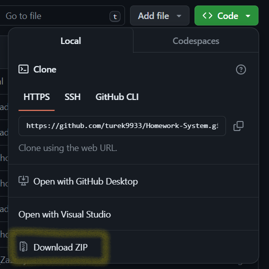
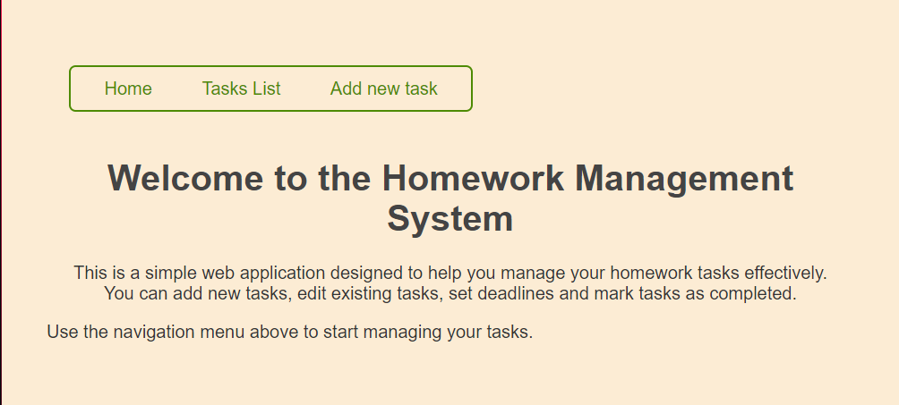
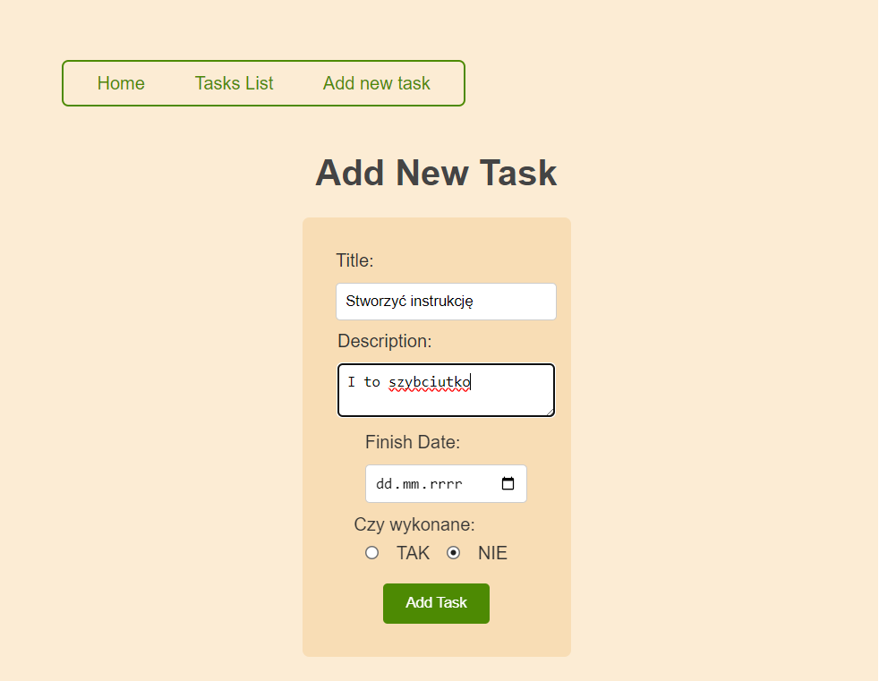
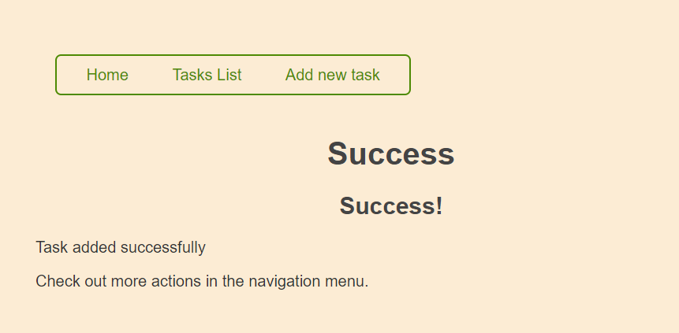
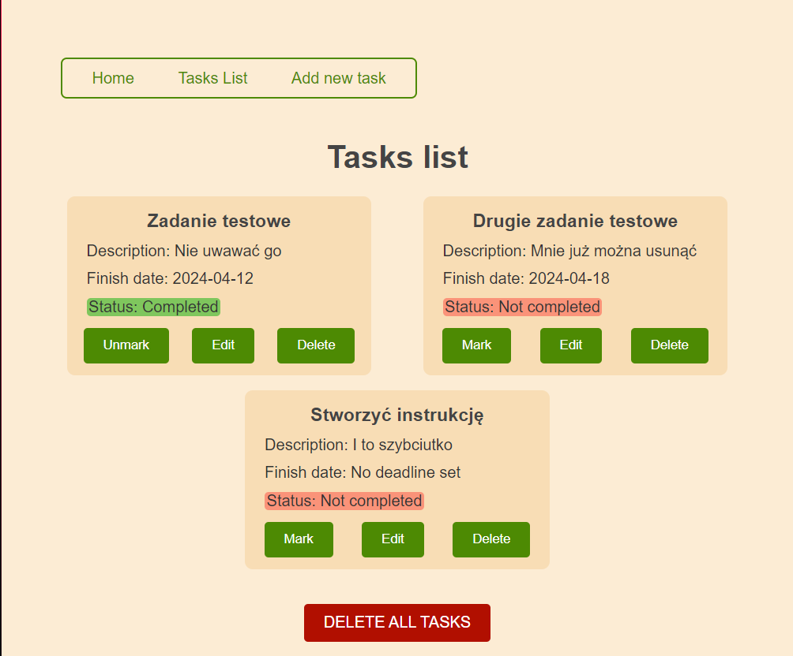
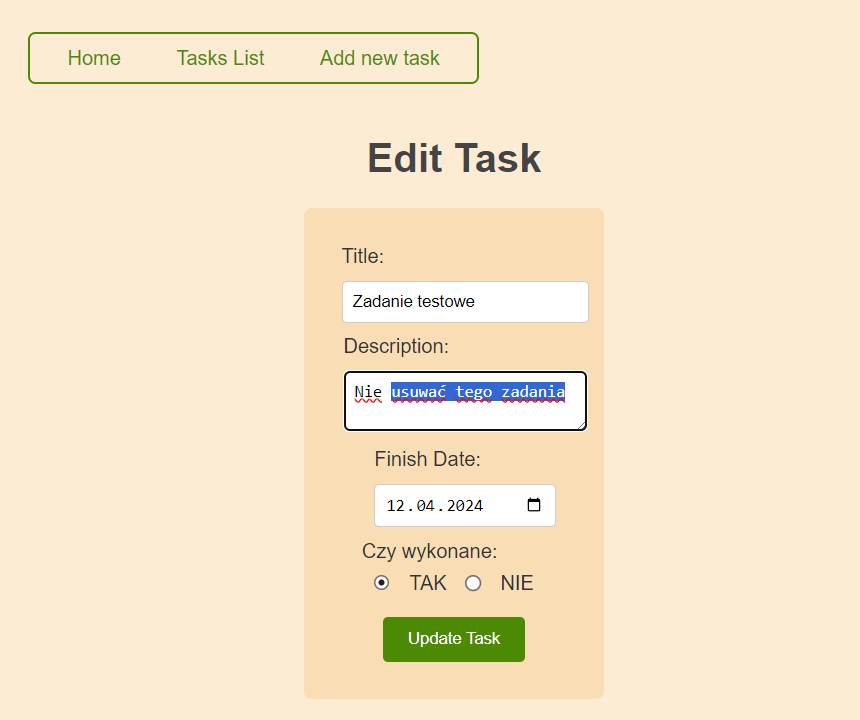

# Homework-System
System zarządzania zadaniami domowymi - Projekt na studia - Wzorzec MVC\
Tomasz Turek\
08.04.2024r.\
v.1.0

# Tytuł: System zarządzania zadaniami domowymi

## Spis treści

1. [Opis projektu i funkcjonalności](#opis-projektu-i-funkcjonalności)
    1. [Opis ogólny](#opis-ogólny)
    2. [Funkcjonalności](#funcjonalności)
2. [Instrukcja instalacji i obsługi](#instrukcja-instalacji-i-obsługi)
    1. [Opis instalacji](#opis-instalacji)
    2. [Instrukcja obsługi](#instrukcja-obsługi)

# Opis projektu i funkcjonalności

## Opis ogólny

Aplikacja jest przeglądarkowa. Służy ona do zarządzania zadaniami użytkownika. Pozwala ona na wyświetlanie zapisanych zadań, dodawanie nowych zadań, edycję i usuwanie zapisanych zadań, a także zaznaczanie oraz odznaczanie wykonania zadania.\
Wszystkie okienka mają nawigację do widoku głównego, do podglądu zapisanych zadań i do dodwania nowych zadań.\
Aplikacja jest dostarczana z przykładowymi zadaniami, które oczywiście można usunąć.\
W ramach aplikacji są wykorzystywane paczki: Body-parser; EJS; Express.

## Funcjonalności

## Wyświetlanie zadań i manipulacja istniejącymi

Aplikacja pozwala na wyświetlanie dodanych już zadań w dwóch kolumnach.\
Pośród pól zadania jest:
- tytuł;
- opis;
- data;
- status.

Dla istniejących, wyświetlanych zadań można wykonać następujące czynności: zaznaczyć/odznaczyć wykonanie zadania, dokonać edycji treści zadania, usunąć jedno lub wszystkie zadania.

## Dodawanie zadań

Aplikacja pozwala na dopisywanie do bazy kolejnych zadań z formularza dostępnego dla użytkownika.\
Spośród pól zadań wyłącznie tytył jest wymagany.

# Instrukcja instalacji i obsługi

## Opis instalacji

### Wymagania:
- Node.js - zainstlowany Node.js (oficjalna strona: https://nodejs.org/);
- npm - Node Package Manager - dostarczany wraz z Node.js;
- Git - zainstalowana obsługa repozytoriów (oficjalna strona: https://git-scm.com).

### Instalacja:
Składa się z dwóch części: Pobrania zawartości repozytorium oraz z uruchomienia aplikacji.

#### Pobranie zawartości repozytorium - Sposób I
Sklonuj repozytorium do wybranego folderu używając Gita. Otwórz terminal i wpisz następujące polecenie:\

Przejdź do wybranego folderu:\
Windows:
> cd Dysk:\sciezka\gdzie\ma\byc\aplikacja

Linux:
> cd /sciezka/gdzie/ma/byc/aplikacja

Sklonuj repozytorium:
> git clone https://github.com/turek9933/Homework-System.git

Przejdź komendą do katalogu aplikacji:
> cd Homework-System

#### Pobranie zawartości repozytorium - Sposób II

Pobierz skompresowaną (.ZIP) zawartość repozytorium. Znajduje się ona na głównej stronie repozytorium. Ścieżka do znalezienia:\
'<> Code>' -> 'Local' -> 'Download ZIP

Wypakuj następnie pobraną zawartość do wybranego folderu (za pomocą np. aplikacji 7-Zip).

Przejdź do wypakowanego katalogu. Może on mieć ścieżkę dostępu np.:
> C:\Users\account\Downloads\Homework-System-main\Homework-System-main

#### Uruchomienie aplikacji - Sposób I

Wewnątrz katalogu z aplikacją uruchom terminal.

Zainstaluj niezbędne komponenty aplikacji (opcjonalnie):
> npm install

Uruchom serwer: 
> npm start

#### Uruchomienie aplikacji - Sposób II

Wewnątrz katalogu z aplikacją znajdź i uruchom skrypt o nazwie 'start-app.bat' - dla Windowsa lub 'start-app.sh' - dla Linuxa.

Jeśli na Linuxie nie skrypt nie działa to prawdopodobnie trzeba nadać mu atrybut wykonywalności. Uruchom terminal w miejscu skryptu i wpisz:
> chmod +x start-app.sh

Program będzie dostępny do czasu wyłączenia ostatniej komendy lub skryptu pod adresem:\
http://localhost:3000

## Instrukcja obsługi

Aplikacja jest przeglądarkowa. Po uruchomieniu jest dostępna pod adresem: http://localhost:3000

#### Okienko Home
Powinna ona generować okienko tytułowe, gdzie opisuje krótko funkcjonalności i zachęca do korzystania z nawigacji.

Za pomocą nawigacji można przejść do okienka z listą zadań lub do okieka, gdzie można dodać nowe zadanie.

#### Okienko Add new task
Pozwala na dodanie nowego zadania do listy. Możemy dodać tytuł, opis, datę planowanego ukończenia oraz informację, czy jest ono już wykonane.

Po naciśnięciu przycisku 'Add Task', zostaniemy przeniesieni do okienka z informacją o sukcesie dodanego zadania.

#### Okienko Success
W przypadku dodania, edycji, usunięcia zadania lub usunięcia wszystkich zadań zostajemy przekierowani na stronę z odpowiednim komunikatem.

#### Okienko Tasks List
Pozwala na ogądanie dodanych już zadań.
Możemy za pomocą przycisków: zaznaczyć/odznaczyć wykonanie danego zadania; edytować dane zadanie; usunąć dane zadanie; usunąć wszystkie zadania.

#### Okienko Edit Task
Edycja zadania odbywa się w osobnym okienku, identycznym jak okienko do dodawania zadań.

